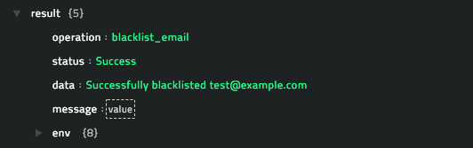
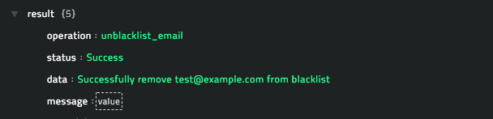
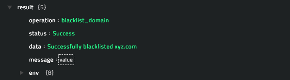
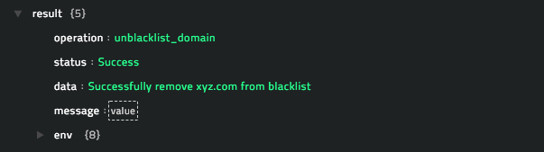
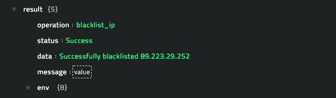
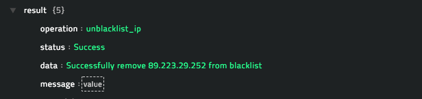

## About the connector
Symantec Messaging Gateway (SMG) delivers inbound and outbound messaging security, real-time antispam and antivirus protection, advanced content filtering, threat detection and sandboxing, and data loss prevention to your enterprise. SMG provides various features such as, detection of spam, denial-of-service attacks and other inbound email threats, filtration of email by policies to remove unwanted content, compliance with regulations, and protection against intellectual property and data loss over email, and integration with Symantec Content Analysis to provide advanced threat detection and virtual sandboxing.

This document provides information about the Symantec Messaging Gateway connector, which facilitates automated interactions, with Symantec Messaging Gateway using CyOPs™ playbooks. Add the Symantec Messaging Gateway connector as a step in CyOPs™ playbooks and perform automated operations, such as blocking or unblocking IP address, domains, or emails.

### Version information
Connector Version: 1.0.0

Compatibility with CyOPs™ Versions: 4.10.3-161 and later

Compatibility with Symantec Messaging Gateway Versions: 10.6.5 and later

## Installing the connector

All connectors provided by  CyOPs™ are delivered using a CyOPs™ repository. Therefore, you must set up your CyOPs™ repository and use the `yum` command to install connectors:

`yum install cyops-connector-symantec-messaging-gateway`

To update your Symantec Messaging Gateway connector use the following command:

`yum update cyops-connector-symantec-messaging-gateway`

To remove your Symantec Messaging Gateway connector use the following command:

`yum remove cyops-connector-symantec-messaging-gateway`

The process to write your own custom connector is defined in the `Building a custom connector` topic.

## Prerequisites to configuring the connector

- You must have the URL of Symantec Messaging Gateway on which you will perform the automated operations and the username and password configured for your account to access that Symantec Messaging Gateway.  
- To access the CyOPs™ UI, ensure that port 443 is open through the firewall for the CyOPs™ instance.

## Configuring the connector

!!! Note  
		This procedure assumes that you are using CyOPs™ version 4.10.3. If you are using a different version of CyOPs™, such as CyOPs™ 4.9, then it is possible that the CyOPs™ UI navigation is different. Refer to the CyOPs™ documentation of that particular version for details about CyOPs™ navigation.

1. In CyOPs™, on the left pane, click **Automation** > **Connectors**.   
   On the `Connectors` page, you will see the `Symantec Messaging Gateway` connector.
2. To configure the connector parameters, click the Symantec Messaging Gateway connector row to open the **Configurations** tab. Enter the required configuration details in the **Configurations** tab.   
   You must provide a name for you configuration and you can optionally check the **Mark As Default Configuration** checkbox to make Symantec Messaging Gateway connector point to this configuration by default.  
   You must provide configuration parameters such as the URL of Symantec Messaging Gateway on which you will perform the automated operations and the username and password configured for your account to access that Symantec Messaging Gateway.  
   For a complete list of configuration parameters, see the [Configuration parameters](#Configuration-parameters) section.  
   **Note**: You can add multiple configurations if you have more than one Symantec Messaging Gateway instances in your environment. You must, therefore, specify a unique `Name` to identify each configuration in your environment.  
   If you have previous versions of a connector and you are configuring a newer version of that connector, with the same configuration parameters, then CyOPs™ fetches the configuration and input parameters of the latest available version of that connector. For example, If you have 1.0.0, 1.1.0, 1.2.0, and 1.3.0 versions of the Symantec Messaging Gateway connector and you are configuring the 1.4.0 version of the Symantec Messaging Gateway connector, then while configuring the 1.4.0 version,  CyOPs™ will fetch the configuration and input parameters from the 1.3.0 version of the Symantec Messaging Gateway connector. You can review the configuration and input parameters, and then decide to change them or leave them unchanged. 
3. To save your configuration, click **Save**.  
   To view the list of actions that can be performed by the connector, click the **Actions** tab.  
   To view the playbook file that is bundled with the connector, click the **Playbooks** tab. Refer to the [Included Playbooks](#Included-playbooks) section for details on the bundled playbooks. You can see the bundled playbooks by clicking on the **Sample - Symantec Messaging Gateway - 1.0.0** link after importing the Symantec Messaging Gateway connector.   
   You can also see the bundled playbooks in the **Automation** > **Playbooks** section in CyOPs™ after importing the Symantec Messaging Gateway connector.  
   Once you click **Save** the Symantec Messaging Gateway connector performs a health check.
4. (Optional) You can also perform the health check and check the connectivity to the Symantec Messaging Gateway and validity of the credentials provided anytime, by clicking the **Refresh** icon that is present in the `Health Check` bar.   
   If all the details are correct and the connectivity to the Symantec Messaging Gateway is established then on the `Connectors` page, **Available** is displayed in the health check dialog.  
   If any or all the details are incorrect or if the connectivity to the Symantec Messaging Gateway cannot be established then on the `Connectors` page, **Disconnected** is displayed in the health check dialog.

### Configuration parameters

In CyOPs™, on the Connectors page, select the **Symantec Messaging Gateway** connector and click **Configure** to configure the following parameters:

| Parameter  | Description                                                  |
| ---------- | ------------------------------------------------------------ |
| Server URL | URL of the Symantec Messaging Gateway server to which you will connect and perform automated operations. |
| Username   | Username for accessing Symantec Messaging Gateway to which you will connect and perform the automated operations. |
| Password   | Password for accessing Symantec Messaging Gateway to which you will connect and perform the automated operations. |
| Verify SSL | Specifies whether the SSL certificate for the server is to be verified or not.  Defaults to `True`. |

## Actions supported by the connector

The following automated operations can be included in playbooks and you can also use the annotations to access operations from CyOPs™ release 4.10.0 onwards:

| Function       | Description                                                  | Annotation and Category           |
| -------------- | ------------------------------------------------------------ | --------------------------------- |
| Block Email    | Adds an email address that you have specified to the list of bad senders on Symantec Messaging Gateway. | block_email   Containment    |
| Unblock Email  | Removes an email address that you have specified from the list of bad senders on Symantec Messaging Gateway. | unblock_email   Remediation  |
| Block Domain   | Adds a domain that you have specified to the list of bad senders on Symantec Messaging Gateway. | block_domain   Containment   |
| Unblock Domain | Removes a domain that you have specified from the list of bad senders on Symantec Messaging Gateway. | unblock_domain   Remediation |
| Block IP       | Adds an IP address that you have specified to the list of bad senders on Symantec Messaging Gateway. | block_ip   Containment       |
| Unblock IP     | Removes an IP address that you have specified from the list of bad senders on Symantec Messaging Gateway. | unblock_ip   Remediation     |

### operation: Block Email

#### Input parameters

| Parameter     | Description                                                  |
| ------------- | ------------------------------------------------------------ |
| Email Address | Email address that you want to block, i.e., add to the list of bad senders on Symantec Messaging Gateway. |

#### Output

The JSON output returns a `Success` message if the email address that you have specified is successfully added to the list of bad senders on Symantec Messaging Gateway.

Following image displays a sample output:

### operation: Unblock Email

#### Input parameters

| Parameter     | Description                                                  |
| ------------- | ------------------------------------------------------------ |
| Email Address | Email address that you want to unblock, i.e., remove from the list of bad senders on Symantec Messaging Gateway. |

#### Output

The JSON output returns a `Success` message if the email address that you have specified is successfully removed from the list of bad senders on Symantec Messaging Gateway.

Following image displays a sample output:

### operation: Block Domain

#### Input parameters

| Parameter | Description                                                  |
| --------- | ------------------------------------------------------------ |
| Domain    | Name of the domain that you want to block, i.e., add to the list of bad senders on Symantec Messaging Gateway. |

#### Output

The JSON output returns a `Success` message if the domain name that you have specified is successfully added to the list of bad senders on Symantec Messaging Gateway.

Following image displays a sample output:

### operation: Unblock Domain

#### Input parameters

| Parameter | Description                                                  |
| --------- | ------------------------------------------------------------ |
| Domain  | Name of the domain that you want to unblock, i.e., remove from the list of bad senders on Symantec Messaging Gateway. |

#### Output

The JSON output returns a `Success` message if the domain name that you have specified is successfully removed from the list of bad senders on Symantec Messaging Gateway.

Following image displays a sample output:

### operation: Block IP

#### Input parameters

| Parameter | Description                                                  |
| --------- | ------------------------------------------------------------ |
| IP Address   | IP address that you want to block, i.e., add to the list of bad senders on Symantec Messaging Gateway. |

#### Output

The JSON output returns a `Success` message if the IP address that you have specified is successfully added to the list of bad senders on Symantec Messaging Gateway.

Following image displays a sample output:

### operation: Unblock IP

#### Input parameters

| Parameter | Description                                                  |
| --------- | ------------------------------------------------------------ |
| IP Address   | IP address that you want to unblock, i.e., remove from the list of bad senders on Symantec Messaging Gateway. |

#### Output

The JSON output returns a `Success` message if the IP address that you have specified is successfully removed from the list of bad senders on Symantec Messaging Gateway.

Following image displays a sample output:

## Included playbooks

The `Sample - Symantec Messaging Gateway - 1.0.0`  playbook collection comes bundled with the Symantec Messaging Gateway connector. This playbook contains steps using which you can perform all supported actions. You can see the bundled playbooks in the **Automation** > **Playbooks** section in CyOPs™ after importing the Symantec Messaging Gateway connector.

- Block Domain
- Block Email
- Block IP
- Unblock Domain
- Unblock Email
- Unblock IP

**Note**: If you are planning to use any of the sample playbooks in your environment, ensure that you clone those playbooks and move them to a different collection, since the sample playbook collection gets deleted during connector upgrade and delete.

